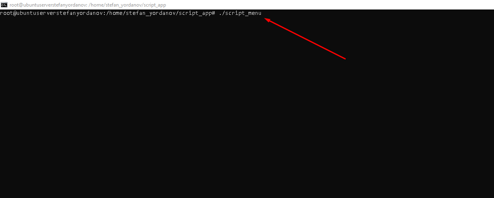
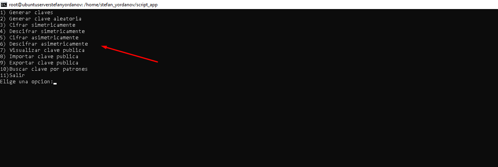

**Autor**: Stefan Yordanov Stefanov

**Script**: Script desarrollado en bash para el modulo de Seguridad.

**Requisitos, instalación y uso.**:

**Requisitos:**  
1: Tener tanto Windows de tu maquina fisica como la virtual de Ubuntu Server Instalados SSH.
             
2: Descargar el zip desde github y meterlo en una carpeta creada por ti en C: por ejemplo C:\Carpeta_subir_zip.
            
**Instalacion:**  
3: En Windows abrimos un Powershell como administradores y escribimos el siguiente comando 
             scp 'C:\Nombre_Carpeta_Donde_Esta_El_Zip\El_archivo_zip' nombre_usuario_maquina_virtual@ip_maquina_virtual:ruta_a_subir_zip ejemplo /home/stefan.
             
4: Entramos en nuestra maquina virtual dentro del repositorio donde esta el zip y hacemos uso del comando unzip nombre_fichero_zip -d (directorio al que iran los ficheros una vez descomprimamos) 
directorio_probar_app como ejemplo. 
             
Nota: Si no esta el comando zip disponible sudo apt install zip.

5: Entramos dentro del directorio que se nos genero en el paso 4 y tendremos los scripts que componen la aplicacion pero sin la x de ejecutar , entonces habra que hacerse chmod +x a todos los script.

6: Una vez eso este hecho , ya se podria probar la app con los diferentes scripts.

Nota: Los pasos de uso a seguir los he explicado en el apartado ''Ejemplos de ejecucion (comandos/ejecucion)''.

**Ejemplos de ejecución (comandos/capturas):**

1: Ejecutamos el script menu ./script_menu.
Nos deberia aparecer algo como esto.

2: Si elegimos la opcion 1 (escribiendo 1) nos va generar las claves publica y privada en un directorio llamado /claves que se va crear al ejecutar dicha opcion

3: Si elegimos la opcion 2 (escribiendo 2) nos va generar una clave aleatoria que se guardara en el directorio /claves

4: Si elegimos La opcion 3 (escribiendo 3) necesitaremos crear un archivo dentro del directorio para que podamos cifrarlo de forma simetrica con la clave aleatoria.

5: Si elegimos la opcion 4 (escribiendo 4) una vez hemos encriptado el fichero con la opcion 3 , al darle clic nos pedira el nombre del fichero que en este caso es el test.enc , para descifrarlo
  se nos queda el archivo que habiamos cifrado previamente mas su opuesto que es el fichero descifrado.

6: Si elegimos la opcion 5 (escribiendo 5) generamos otro fichero para cifrar de forma asimetrica , lo que hara es cifrar con la clave publica tanto los datos del fichero como la clave AES y nos generara dos ficheros
un fichero test2.enc (Ejemplo) y test2.key.enc (Ejemplo)

7: Si elegimos la opcion 6 (escribiendo 6) vamos a descifrar con la clave privada , nos pedira el nombre del fichero a descifrar sin la extension enc y primero descifrara la clave AES y la renviara a un tmp/claves_aes.key ,
despues el archivo se descifrara en descifrado_asimetrico y se lo pasaremos al tmp/claves_aes.key y por ultimo borrara es directorio temporal tmp/claves_aes.key

8: Si elegimos la opcion 7 (escribiendo 7) vamos a visualizar nuestra clave publica

9: Si elegimos la opcion 8 (escribiendo 8) vamos a importar nuestra clave publica a otro directorio , nos pedira primero la ruta donde esta nuestra clave publica que como el directorio esta a nivel del script,
pues escribiremos claves/clave_publica.pem. Se generara un directorio keyring con nuestra clave publica ahi

10: Si elegimos la opcion 9 (escribiendo 9) vamos a exportar nuestra clave publica a un directorio que le digamos , no hace falta que exista porque lo creara el script , la ruta de la clave publica seria claves/clave_publica.pem y
finalmente el nombre del directorio o ruta donde lo queremos exportar.

11: Si elegimos la opcion 10 (escribiendo 10) vamos a visualizar en que directorio estan las claves, es decir , vamos a filtrar por patrones .pub , .publica.pem , .pem etc... , nos pedira en que directorio buscar esas claves o patrones ,
he usado el directorio claves(ejemplo) para mostrarlo

12: Si elegimos la opcion 11(escribiendo 11) salimos del menu

**Breve explicación del cifrado híbrido.**:

Cifrado asimétrico (híbrido).

El cifrado híbrido combina cifrado simétrico y cifrado asimétrico para aprovechar las ventajas de ambos métodos:

**Cifrado simétrico con AES-256:**

Para cada archivo a proteger, se genera una clave AES-256 aleatoria.

Esta clave se utiliza para cifrar el contenido del archivo de forma rápida y eficiente, incluso si el archivo es grande.

**Protección de la clave simétrica con RSA:**

La clave AES generada se cifra utilizando la clave pública RSA del destinatario.

Esto produce un archivo separado que contiene la clave protegida. Solo quien tenga la clave privada RSA correspondiente puede descifrarla.

**Descifrado del archivo:**

Primero se usa la clave privada RSA para recuperar la clave AES.

Luego, con esa clave AES, se descifra el archivo original y se obtiene el contenido completo.

**Ventajas del enfoque híbrido:**

Combina la rapidez del cifrado simétrico con la seguridad del cifrado asimétrico.

Permite enviar archivos cifrados de manera segura a múltiples destinatarios cifrando la misma clave AES con distintas claves públicas.

Mantiene los datos confidenciales incluso si se intercepta el archivo cifrado, ya que la clave AES está protegida asimétricamente.

